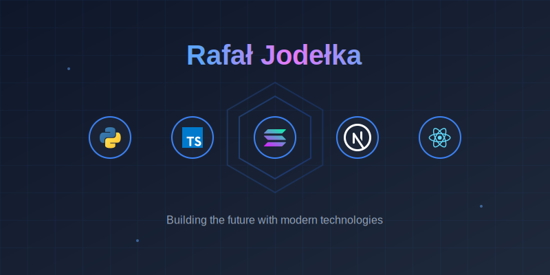

<div align="center">
  


# > DIGITAL INNOVATOR_


</div>

## 📊 GitHub Stats
<div align="center">

[](https://github.com/ChefJodlak:?tab=repositories)

</div>

## ⚡ Tech Arsenal

```python
class Developer:
    def __init__(self):
        self.name = "Rafał Jodełka"
        self.role = "Digital Innovator"
        self.stack = {
            "languages": ["Python", "JavaScript", "TypeScript"],
            "web": ["React", "Next.js", "Node.js"],
            "web3": ["Solana", "Ethereum", "DeFi"],
            "tools": ["Git", "Docker", "AWS"]
        }
    
    def current_focus(self):
        return "Building the bridge between Web3 and AI"
```

## 🚀 Skills & Technologies

### Languages & Frameworks
- **Frontend:** React.js, Next.js, TypeScript, TailwindCSS
- **Backend:** Python, Node.js, Express
- **Web3:** Solana, Ethereum

### Tools & Platforms
- **DevOps:** Git, Docker, AWS
- **Databases:** PostgreSQL, MongoDB, Redis
- **Tools:** Cursor, Figma

## 🌟 Highlights

- 🤖 **AI Development**: Crafting intelligent solutions
- ⛓️ **Web3**: Building the decentralized future
- 🚀 **Full Stack**: Creating seamless experiences
- 🔮 **Innovation**: Pushing technological boundaries

</div>

## 🌐 Connect with Me

<div align="center">

[](https://www.linkedin.com/in/rafa%C5%82-jode%C5%82ka-7a8713142/)
[](https://x.com/jodlak_)

</div>

---
<div align="center">
    <i>Let's build something extraordinary together</i> 🚀
</div>
